<h1 align="center">Hey, I'm Kalyan 👋</h1>

<h3 align="center">
  Full Stack Developer · Professional Bug Creator · Occasional Bug Fixer
</h3>

<p align="center">
  Turning random ideas, caffeine, and questionable architectural decisions into working products.
</p>

<p align="center">
  <a href="https://www.kalyanmanna.com">🌐 Portfolio</a>
  ·
  <a href="https://www.linkedin.com/in/kalyan-manna-840861352">💼 LinkedIn</a>
  ·
  <a href="mailto:kalyanmanna439@gmail.com">📫 Email</a>
</p>

---

## ⚡ Things I Somehow End Up Building

* 🚀 Full-stack web & mobile apps
* 🤖 AI-powered tools that may or may not replace my own workflow
* 🏗️ Backend systems that start simple and somehow become distributed systems
* 🧪 Hackathon projects built with 30% code and 70% panic
* 💼 Freelance projects for people who say *"it's just a small feature"*
* 🗑️ Tools for finding code that nobody remembers writing

---

## 🚀 Stuff I've Built

### 🗑️ Deadweight

A VS Code extension that finds unused packages and dead files.

Because apparently `node_modules` wasn't already terrifying enough.

> **Goal:** Find out what you can delete without turning production into a crime scene.

---

### 🏠 EasyPG

A platform for finding PGs, hostels and messes.

Because finding a decent place to live shouldn't require 47 WhatsApp groups, three brokers and divine intervention.

**Motto:** `Find Home, Away From Home`

---

## 🛠️ My Current Weapon Collection

<p align="center">
  
</p>

---

## 🧠 Currently Making My Brain Hurt With

`System Design` · `Distributed Systems` · `WebRTC` · `Real-Time Systems`

`AI Engineering` · `Cloud Infrastructure` · `Database Architecture`

`Caching` · `Performance Optimization` · `Scalable APIs`

Currently learning **how Netflix serves millions of people while my localhost struggles with 3 tabs.** 💀


---

## 📊 GitHub Stats

<div align="center">

<table>
<tr>
<td align="center">
  
</td>
<td align="center">
  
</td>
</tr>
</table>

</div>

---

## 🏆 GitHub Trophies

<p align="center">
  
</p>

---

## 🧑‍💻 My Development Methodology

```text
Have an idea
     ↓
"How hard can it be?"
     ↓
npm install
     ↓
npm install again
     ↓
Something breaks
     ↓
ChatGPT/Claude
     ↓
GitHub Issues
     ↓
"Ah, I understand now."
     ↓
Break something else
     ↓
Fix it
     ↓
"It works!"
     ↓
DO NOT TOUCH IT
```

---

## 💀 Current Status

```text
☑️ Building something
☑️ Breaking something
☑️ Fixing something
☑️ Learning something
☑️ Pretending the architecture was intentional
☐ Touching grass
```

---

<h3 align="center">
  Build. Break. Learn. Ship. Repeat. 🚀
</h3>

<p align="center">
  <i>Currently somewhere between npm install and "it works on my machine".</i> 💀
</p>
